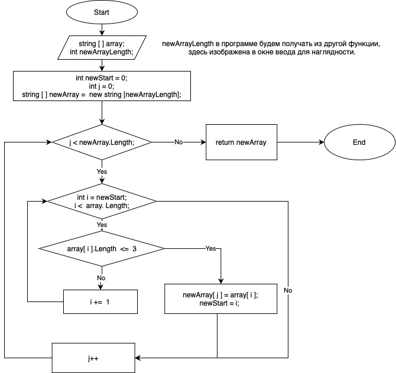

# Алгоритм метода перенесения элементов, удовлетворяющих условиям, из 1-го массива в другой.

1. ## Начало
2. ## Ввод массива из строк и длинны нового массива.
3. ## Создание переменных для счетчиков циклов массивов и точки старта для повторного пребора 1-го массива и пустого массива с длинной newArrayLength;
4. ## Цикл для заполнения newArray: если j мельше длинны newArray, то переходим в пункт 5, иначе переходим в пункт 6.
5. ## Цикл для перебора array:
   1. ### если i < длинны массива, то входим в цикл:
      - проверка элемента массива под индексом i
        - если длина элемента меньше, либо равно 3, то выводим элемент в консоль и счетчик j увеличиваем на 1, переменной newStart пристваиваем значение i и возвращаемся в пункт 4
        - иначе просто увеличиваем счетчик i на 1;
   2. ### если i >= длинны массива, то выходим из цикла, увеличиваем счетчик j на 1 и возвращаемся в пункт 4.
6. ## Возвращаем newArray;
7. ## Конец
